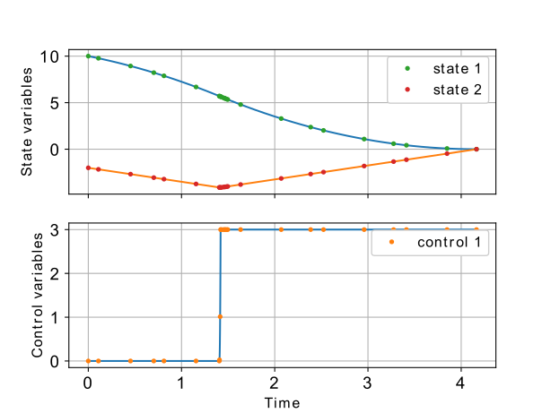
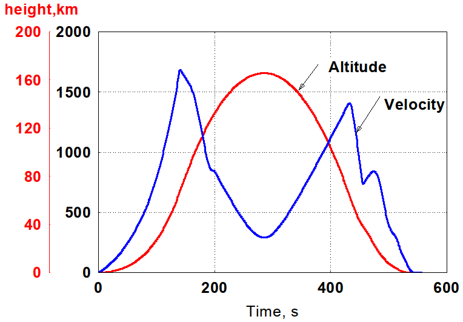

:github_url: https://github.com/mpopt/mpopt/blob/docs/docs/source/index.rst

.. title:: MPOPT

########################################
MPOPT : Optimal control problem solver
########################################

Simple to use, optimal control problem solver library in Python: `GitHub <https://github.com/mpopt/mpopt/>`_.

*MPOPT* is an open-source, extensible, customizable and easy to use
Python package that includes a collection of modules to solve
multi-stage non-linear optimal control problems(OCP) in the standard Bolza form using
pseudo-spectral collocation methods.

.. toctree::
    :numbered:
    :maxdepth: 1

    introduction.rst
    installation.rst
    getting_started.rst
    examples.rst
    notebooksPy.rst
    documentation.rst
    developer_notes.rst
    ENDMATTER.rst

Resources
===========
-  Detailed implementation aspects of MPOPT are part of the `master thesis <http://dx.doi.org/10.13140/RG.2.2.19519.79528>`_.
-  Quick introduction `presentation <http://dx.doi.org/10.13140/RG.2.2.14486.63040>`_.
-  List of solved `examples <examples>`_
-  Features of MPOPT in `Jupyter Notebooks <notebooks/getting_started.ipynb>`_

A pdf version of this documentation can be downloaded from `PDF document <https://mpopt.readthedocs.io/_/downloads/en/latest/pdf/>`_

A must read Jupyter notebook on MPOPT features `Getting Started <notebooks/getting_started.ipynb>`_

Case studies
==============

- Quick demo of the solver using simple moon-lander fuel minimization OCP (bang-bang type control), refer `Quick features demo notebook <notebooks/getting_started.ipynb>`__ for more details. The image below shows the optimal altitude and the velocity profile (states) along with the optimal throttle (controls) to get minimum fuel trajectory to land on moon.

- A complex real-world example of The SpaceX falcon9 rocket orbital launch with the booster recovery results are shown below. OCP is defined to find the optimal trajectory and the thrust profile for booster return, refer `SpaceX Falcon9 booster recovery notebook <notebooks/falcon9_to_orbit.ipynb>`_ for more details. The first image below is the MPOPT solution using adaptive mesh and the second one is the real-time data of the SpaceX Falcon9 launch of NROL76 mission. The ballistic altitude profile of the booster is evident in both MPOPT solution and the real-time telemetry. Further, the MPOPT velocity solution compares well with the real-time data even though the formulation is only a first order representation of the actual booster recovery problem.

Features and Limitations
===============================
While MPOPT is able to solve any Optimal control formulation in the Bolza form, the present limitations of MPOPT are,

- Only continuous functions and derivatives are supported
- Dynamics and constraints are to be written in CasADi variables (Familiarity with casadi variables and expressions is expected)
- The adaptive grid though successful in generating robust solutions for simple problems, doesnt have a concrete proof on convergence.

Authors
========

-  **Devakumar THAMMISETTY**
-  **Prof. Colin Jones** (Co-author)

License
=======

This project is licensed under the GNU LGPL v3 - see the
`LICENSE <https://github.com/mpopt/mpopt/blob/master/LICENSE>`__ file
for details

Acknowledgments
===================

-  **Petr Listov**

Cite
=====

-  D. Thammisetty, “Development of a multi-phase optimal control software for aerospace applications (mpopt),” Master’s thesis, Lausanne, EPFL, 2020.

**BibTex entry**:

   @mastersthesis{thammisetty2020development,
         title={Development of a multi-phase optimal control software for aerospace applications (mpopt)},
         author={Thammisetty, Devakumar},
         year={2020},
         school={Master’s thesis, Lausanne, EPFL}}

Indices and tables
=====================

* :ref:`genindex`
* :ref:`modindex`
* :ref:`search`
